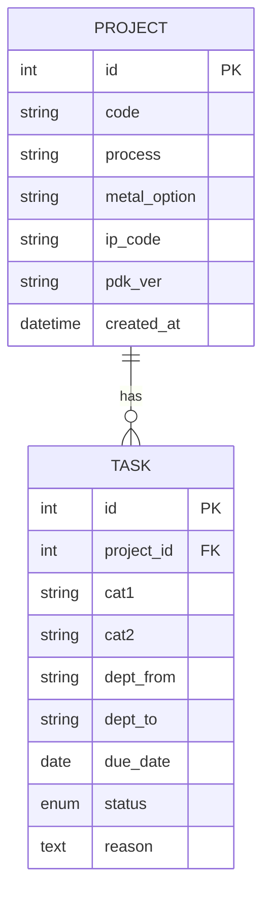
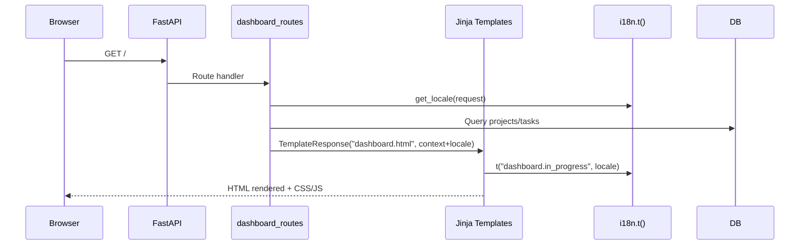

# RPMT — System Overview

- Version: 2025-12-01

## Table of Contents
- Introduction
- Key Features
- Quick Start
- Architecture
- Directory Layout
- Config & Secrets
- Data Model
- Internationalization (i18n)
- Routing Layer
- Templates & UI
- Services & KPI Logic
- Weekly Timeline
- Feedback System
- Static Assets
- Security & Sessions
- Performance & Scalability
- Error Handling
- Deployment
- Roadmap
- Mermaid Diagrams
- Appendix: Pseudocode & FAQs

## Introduction
- Goal: Single web UI to manage projects’ tasks, schedules, delays, and feedback.
- Approach: Jinja2 server-rendered pages with lightweight JS enhancements.
- Philosophy: Clear layering, YAML i18n, SQLite-first simplicity.

## Key Features
- Dashboard: project cards, KPIs, 3-week summary, overdue pulse.
- Project detail: structured task list, inline edits, file previews.
- Weekly timeline: project × week grid with filters/search.
- Admin: CRUD, backup/restore, maintenance.
- Feedback: user submissions, admin triage, email replies.
- i18n: Korean/English switching via cookie; Accept-Language fallback.

## Quick Start
- Prerequisites: Python 3.13, pip.
python -m pip install -r requirements.txt
python -m uvicorn app:app --host 0.0.0.0 --port 8000

- Open: http://localhost:8000

## Architecture
- Layers:
  - Presentation: Jinja2 templates (templates).
  - Routing/API: FastAPI routers (routes).
  - Services: schedule/KPI logic (services.py), utilities (utils.py), preview helpers (services).
  - Data: SQLAlchemy ORM (models.py), session (db.py).
  - Cross-cutting: i18n (i18n.py), config (config.py), middleware (middleware.py).
  - Static: static, uploads, img.

## Directory Layout
- app.py: FastAPI app, template globals (`t`, `compute`, img), static mounts, routers.
- core
  - `config.py`: base paths, `SESSION_SECRET`.
  - `db.py`: SQLAlchemy engine/session dependency.
  - `i18n.py`: YAML loader, `get_locale`, `t`.
  - `middleware.py`: request logging, session config.
  - `utils.py`: IP, visit token, grouping helpers.
  - `cache.py`: placeholder for caching.
- routes: `auth_routes.py`, `dashboard_routes.py`, `project_routes.py`, `admin_routes.py`, `weekly_routes.py`, `help_routes.py`.
- templates: `dashboard.html`, `project_detail.html`, `weekly_v2.html`, `admin.html`, `help.html`, `auth_login.html`, `_admin_tasks_table.html`, `base.html`.
- locales: `ko.yml`, `en.yml`.
- static: `style.css`, `app.js`.
- data: `default_tasks.py`, `feedback.json`.
- services: `file_preview.py`, `metrics.py`.
- uploads: user files.
- img: static images.

## Config & Secrets
- .env variables:
  - `OUTLOOK_EMAIL`, `OUTLOOK_PASSWORD`: for feedback email notifications/replies.
  - `ADMIN_EMAIL`: admin notification recipient.
- Sessions:
  - `SESSION_SECRET`: cookie signature; defined in config.py.
- Recommendation: use environment variables or secret manager in production.

## Data Model
- `StatusEnum`: `"Complete"`, `"In-progress"`, `"Not Started"`, `"N/A"`.
- `Project`:
  - Fields: `id`, `code`, `process`, `metal_option`, `ip_code`, `pdk_ver`, `created_at`.
  - Relationship: `tasks: list[Task]`.
- `Task`:
  - Fields: `id`, `project_id`, `cat1`, `cat2`, `dept_from`, `dept_to`, `due_date`, `status`, `reason`.
- Feedback persistence: `feedback.json`.

## Internationalization (i18n)
- YAML translations at ko.yml and en.yml.
- i18n.py:
  - `get_locale(request)`: cookie `lang` → `Accept-Language` header → default `ko`.
  - `t(key, locale, **kwargs)`: nested dot lookup, optional format placeholders.
- app.py: registers `t()` as a template global.
- Usage in templates:
  - `{{ t('dashboard.in_progress', locale) }}`
  - Large bilingual blocks: ` ...  ... `.

## Routing Layer
- `auth_routes.py`: login/logout; sets `is_admin`, `admin_ip`, `admin_visit`.
- `dashboard_routes.py`: `/`; aggregates project KPI, delayed items, weekly triplets.
- `project_routes.py`: CRUD, KPI JSON (`/projects/{pid}/kpi.json`), delays JSON, uploads.
- `admin_routes.py`: bulk edit, backup/restore, vacuum endpoints.
- `weekly_routes.py`: `/weekly/v2`; builds week rows and renders grid.
- `help_routes.py`: `/help`; feedback submission and optional email flows.
- All routes import the shared templates from app.py to ensure `t()` is available.

## Templates & UI
- Header patterns:
  - Brand and logo; language selector; back links on detail pages.
- dashboard.html:
  - KPI buttons, percent bars, tags, 3-week section with chips (overdue pulse).
  - Modals: KPI list and delayed items.
- `project_detail.html`:
  - Category-grouped tasks; inline editing; file preview UI.
- `weekly_v2.html`:
  - Week grid (`projects × weeks`), filters, search.
- `admin.html`:
  - Sidebar navigation, detail pane, backup/restore controls; feedback count polling.
- `help.html`:
  - Extensive bilingual content; feedback modal with localized labels.
- `auth_login.html`:
  - Localized login, cookie-based language toggle.

## Services & KPI Logic
- `_coerce_status(status)`: normalize mixed-language status strings to `StatusEnum`.
- `compute_schedule(due_date, status, soon_threshold=3)`:
  - Returns enum: `NA`, `NO_DUE`, `LATE`, `DUE_TODAY`, `DUE_SOON`, `ON_TRACK`, `DONE`.
  - Includes remaining days and short description.
- `compute_derived(due_date, status_str)`:
  - Compact helper exposed to templates as `compute`.

## Weekly Timeline
- `monday_of(date)`: week alignment.
- `daterange_weeks(start_monday, weeks)`: sequential week spans.
- Color variants per project: `(pid % 8) + 1`.
- Client-side filters: hide/show by status; search filtering.

## Feedback System
- `help_routes.py`:
  - `submit_feedback`: persists to feedback.json.
  - Email integrations (`send_admin_notification`, `send_reply_email`) use Outlook SMTP when configured.
- Admin workflow:
  - `feedback.html`: list, search, mark read/resolved, reply box.

## Static Assets
- `style.css`: variables (`--line`, `--muted`), card variants, chips/pills, modals, layout, responsive tweaks.
- `app.js`: shared JS; most page-specific logic lives inline in templates.

## Security & Sessions
- `SessionMiddleware`: cookie `rams_sess`, 30-minute lifespan, `same_site="lax"`.
- Admin protection: session gate + visit token.
- Upload safety: sanitize filenames, avoid executable types; add MIME checks in production.

## Performance & Scalability
- SQLite for initial internal use; migrate to PostgreSQL for multi-user concurrency.
- ORM optimization: eager loading; indexes; query consolidation.
- Caching: `cache.py` or Redis for computed aggregates.
- Background workers: offload heavy tasks (email, previews).

## Error Handling
- FastAPI defaults + targeted try/except (feedback/email).
- Recommended: global exception handlers, structured logging, error pages.

## Deployment
- Development:
    `python -m uvicorn app:app --reload --host 0.0.0.0 --port 8000`
- Production:
  - Run behind Nginx: HTTPS termination, static caching (static), controlled uploads.
  - Backups: regular SQLite snapshots.
  - Monitoring: middleware logs; consider Prometheus metrics.

## Roadmap
- Consolidate template inheritance on base.html.
- i18n key linting script; completeness checks.
- Dark mode; user preferences.
- Advanced search; charts; WebSocket notifications.
- RBAC and audit logging.
- Feedback storage to DB.

## Mermaid Diagrams
    flowchart LR
        Browser -->|HTTP| FastAPI
        FastAPI -->|Routers| Routes[Auth/Dashboard/Project/Admin/Weekly/Help]
        Routes --> Templates[Jinja2 Templates]
        Routes --> Services[services.py]
        Routes --> DB[(SQLite via SQLAlchemy)]
        Templates --> Static[/static CSS/JS/IMG/]
        Templates --> i18n[core/i18n t()]
        FastAPI --> Middleware[Sessions/Logging]
        Services --> Utils[core/utils]
        Routes --> Uploads[/uploads/]
### Architecture Overview
```mermaid
flowchart LR
    Browser -->|HTTP| FastAPI
    FastAPI -->|Routers| Routes[Auth/Dashboard/Project/Admin/Weekly/Help]
    Routes --> Templates[Jinja2 Templates]
    Routes --> Services[services.py]
    Routes --> DB[(SQLite via SQLAlchemy)]
    Templates --> Static[/static CSS/JS/IMG/]
    Templates --> i18n[core/i18n t()]
    FastAPI --> Middleware[Sessions/Logging]
    Services --> Utils[core/utils]
    Routes --> Uploads[/uploads/]
```

### Entity Relationship (Simplified)


### Request Flow (Dashboard Example)


## Appendix: Pseudocode

Locale selection
```
def get_locale(request):
    lang = request.cookies.get("lang")
    if lang in ("ko", "en"): return lang
    al = request.headers.get("accept-language", "")
    for token in parse(al):
        if token.startswith(("ko", "en")): return token[:2]
    return "ko"
```

Translation lookup
```
def t(key, locale, **kwargs):
    node = translations.get(locale, {})
    for part in key.split("."):
        node = node.get(part)
        if node is None: return key
    return node.format(**kwargs) if kwargs else node
```

KPI computation
```
def compute_schedule(due, status):
    s = normalize(status)
    if s == NA: return (NA, None, "해당 없음")
    if s == COMPLETE: return (DONE, 0, "완료")
    if not due: return (NO_DUE, None, "마감 없음")
    d = (due - today()).days
    if d < 0: return (LATE, -d, f"지연 {abs(d)}일")
    if d == 0: return (DUE_TODAY, 0, "오늘 마감")
    if d <= 3: return (DUE_SOON, d, f"잔여 {d}일")
    return (ON_TRACK, d, f"잔여 {d}일")
```

Weekly grid build
```
start = monday_of(today)
rows = daterange_weeks(start, N)
for y,w,ws,we in rows:
  collect tasks in [ws, we)
  bucket per project
render
```

FAQs
- Add language: create `locales/xx.yml`, ensure `t()` keys used across templates.
- DB migration: switch SQLAlchemy engine URL to PostgreSQL and run Alembic.
- JWT: add token issuance and protect routers via dependencies.
- Uploads cloud: move files to S3 and store URLs instead of disk paths.